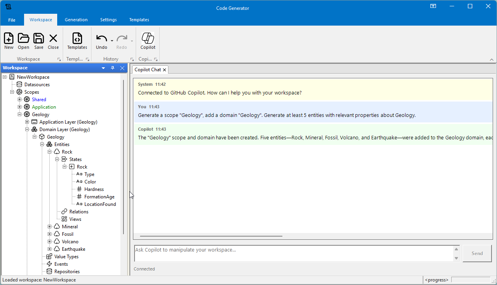

# CodeGenerator




A powerful, extensible .NET 8 code generation framework designed to accelerate software development by automating the creation of boilerplate code from various data sources.

> [!WARNING]
> This project is currently in active development. Features and APIs may change frequently. Use at your own risk.
> It requires a free community Syncfusion license for certain UI components used in the WinForms application.

## Overview

CodeGenerator is a modular code generation solution that transforms your data schemas, database structures, and domain models into production-ready code. 
Whether you're working with SQL Server, PostgreSQL, MySQL, JSON, XML, YAML, CSV, or Excel files, CodeGenerator provides a unified workflow to generate consistent, high-quality code artifacts.

## Key Features

### 🔌 Multiple Data Source Support

Connect to various data sources to drive your code generation:

- **Relational Databases**: SQL Server, PostgreSQL, MySQL
- **Structured Files**: JSON, XML, YAML, CSV, Excel
- **Domain Models**: Define entities, relationships, and state machines

### 📝 Template Engine Integration

- **Scriban Templates**: Powerful, fast, and lightweight templating with built-in functions for common code generation tasks
- **T4 Templates**: Support for Visual Studio T4 text templates
- **PlantUML**: Generate diagrams from your domain models
- **.NET Project Templates**: Generate complete .NET project structures

### 🏗️ Clean Architecture Support

Built-in support for layered architecture code generation:

- **Domain Layer**: Entities, value objects, domain events
- **Application Layer**: Use cases, DTOs, interfaces
- **Infrastructure Layer**: Repositories, external services
- **Presentation Layer**: Controllers, view models

### 🎯 Artifact-Based Generation

- **Hierarchical Artifacts**: Organize generated code in a tree structure
- **Decorators**: Attach metadata and behaviors to artifacts
- **Preview Mode**: Review generated code before writing to disk
- **Progress Tracking**: Monitor generation progress with detailed feedback

### ⚙️ Extensible Generator System

- **Message Bus Architecture**: Generators communicate via events for loose coupling
- **Pluggable Generators**: Easy to add custom generators
- **Configurable Settings**: Per-generator configuration with template assignments

## Built-in Template Functions

CodeGenerator includes powerful built-in functions for Scriban templates:

| Function | Description | Example |
|----------|-------------|---------|
| `pascal_case` | Convert to PascalCase | `customer_name` → `CustomerName` |
| `camel_case` | Convert to camelCase | `CustomerName` → `customerName` |
| `snake_case` | Convert to snake_case | `CustomerName` → `customer_name` |
| `kebab_case` | Convert to kebab-case | `CustomerName` → `customer-name` |
| `pluralize` | Pluralize a word | `Customer` → `Customers` |
| `singularize` | Singularize a word | `Customers` → `Customer` |
| `csharp_type` | Map to C# type | `integer` → `int` |
| `sql_type` | Map to SQL type | `string`, `50` → `NVARCHAR(50)` |
| `nullable_type` | Make type nullable | `int`, `true` → `int?` |

## Project Structure

```
CodeGenerator/
├── CodeGenerator.Core/                    # Core abstractions and interfaces
├── CodeGenerator.Core.Artifacts/          # Artifact system (files, folders, decorators)
├── CodeGenerator.Core.Templates/          # Template engine abstractions
├── CodeGenerator.Core.Generators/         # Generator orchestration
├── CodeGenerator.Core.Workspaces/         # Workspace and datasource management
├── CodeGenerator.Core.DomainSchema/       # Domain modeling
├── CodeGenerator.TemplateEngines.Scriban/ # Scriban template engine
├── CodeGenerator.TemplateEngines.T4/      # T4 template engine
├── CodeGenerator.TemplateEngines.PlantUML/# PlantUML integration
├── CodeGenerator.Generators.DotNet/       # .NET project generators
├── CodeGenerator.Generators.CodeArchitectureLayers/ # Clean architecture generators
├── CodeGenerator.Presentation.WinForms/   # WinForms desktop application
└── CodeGenerator.Application/             # Application layer (MVVM)
```

## Getting Started

### Prerequisites

- .NET 8 SDK or later
- Visual Studio 2022 or compatible IDE

### Building the Solution

```bash
git clone https://github.com/dieterm/code_generator.git
cd code_generator/src
dotnet build
```

### Running the Application

```bash
dotnet run --project CodeGenerator.Presentation.WinForms
```

## Usage

### 1. Create a Workspace

A workspace defines your project context, including:
- Root namespace and output directory
- Data sources (databases, files)
- Domain definitions (entities, relationships)

### 2. Connect Data Sources

Add one or more data sources to import schema information:
- Database connections for SQL Server, PostgreSQL, or MySQL
- File-based sources (JSON, XML, YAML, CSV, Excel)

### 3. Configure Templates

Assign Scriban templates to generators and customize output patterns:
```
OutputPattern: {{EntityName}}.cs
TemplateFile: Templates/Entity.scriban
```

### 4. Generate Code

Run the generation process:
- Preview generated artifacts before writing
- Monitor progress with real-time feedback
- Review and accept generated files

## Example Template

```scriban
// Auto-generated file - Do not modify manually
// Generated: {{ now }}

namespace {{ Namespace }}
{
    public class {{ EntityName | pascal_case }}
    {
        {{- for property in Properties }}
        public {{ property.DataType | csharp_type }}{{ property.IsNullable ? "?" : "" }} {{ property.Name | pascal_case }} { get; set; }
        {{- end }}
    }
}
```

## Architecture

CodeGenerator follows clean architecture principles:

- **Dependency Injection**: Full DI support via `Microsoft.Extensions.DependencyInjection`
- **Event-Driven**: Generator message bus for decoupled communication
- **MVVM Pattern**: Separation of concerns in the presentation layer
- **Plugin Architecture**: Extensible template engines and generators

## Contributing

Contributions are welcome! Please feel free to submit issues, feature requests, or pull requests.

1. Fork the repository
2. Create a feature branch (`git checkout -b feature/amazing-feature`)
3. Commit your changes (`git commit -m 'Add amazing feature'`)
4. Push to the branch (`git push origin feature/amazing-feature`)
5. Open a Pull Request

## License

This project is open source. See the repository for license details.

## Acknowledgments

- [Scriban](https://github.com/scriban/scriban) - Fast, powerful, safe and lightweight scripting language
- [Humanizer](https://github.com/Humanizr/Humanizer) - String manipulation and humanization

---

Made with ❤️ for .NET developers
