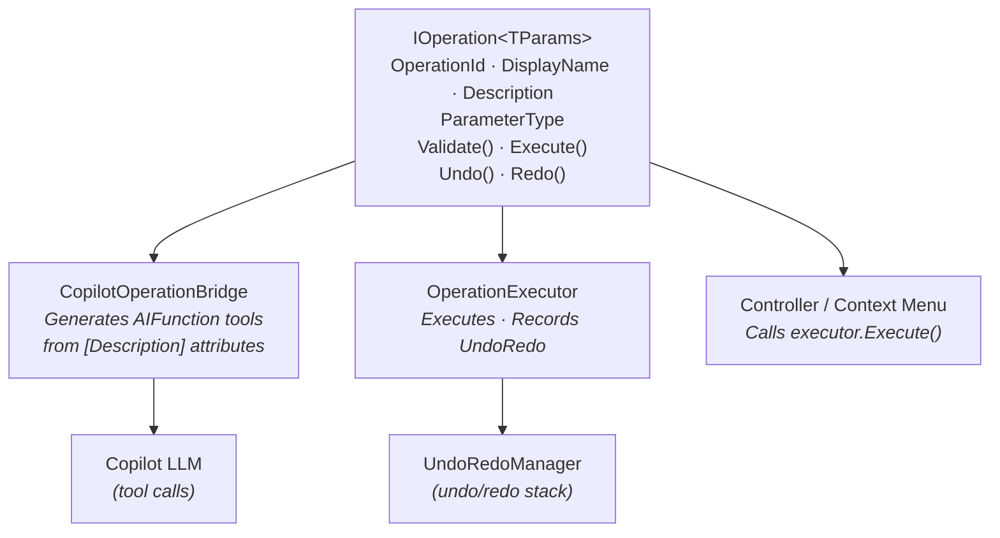

# Workspace Operations Architecture

## Probleemstelling

Workspace-operaties (scope toevoegen, entity aanmaken, property toevoegen, etc.) worden momenteel op meerdere plekken gedefinieerd:

- **`WorkspaceTools`** — Copilot AI tool functies met parameter-metadata
- **Controllers** (`ScopesContainerController`, `SubScopesContainerController`, etc.) — context menu commands

Dit leidt tot duplicatie: dezelfde operatie-logica bestaat op meerdere plekken.

### Drie consumenten voor dezelfde operatie

| Consument | Wat het nodig heeft |
|---|---|
| **Copilot** | Parameter-metadata (namen, types, descriptions) + tool-registratie |
| **UndoRedoManager** | Execute / Undo / Redo |
| **Application code** | Context menu commands, controllers, directe aanroepen |

## Aanpak: `IOperation<TParams>`

Eén operation-class die **alles** bevat: metadata, validatie, execute, undo/redo, en de parameter-definitie als een POCO die zowel door Copilot als door code gebruikt wordt.

### Architectuuroverzicht



### Execution flow

```
Controller/Copilot
    ? OperationExecutor.Execute(operation, params)
        ? operation.Execute(params)                  // voert de operatie uit
        ? new OperationUndoableAction(operation, params) // wraps als IUndoableAction
        ? UndoRedoManager.RecordAction(…)            // registreert in undo stack

User klikt Undo
    ? UndoRedoManager.Undo()
        ? OperationUndoableAction.Undo()
            ? operation.Undo()                       // bijv. RemoveChild

User klikt Redo
    ? UndoRedoManager.Redo()
        ? OperationUndoableAction.Redo()
            ? operation.Redo()                       // bijv. AddChild
```

---

## Geïmplementeerde bestanden

### CodeGenerator.Shared — Infrastructuur

| Bestand | Beschrijving |
|---|---|
| `Operations/IOperation.cs` | `IOperation` (non-generic marker) en `IOperation<TParams>` interface met `Execute`, `Undo`, `Redo` |
| `Operations/OperationResult.cs` | Resultaat-class met `Ok()` en `Fail()` factory methods |
| `Operations/OperationExecutor.cs` | Centraal punt voor registratie, uitvoering en undo/redo recording |
| `Operations/OperationUndoableAction.cs` | Adapter van `IOperation<TParams>` naar `IUndoableAction` voor de `UndoRedoManager` |

### CodeGenerator.Core.Workspaces — Concrete operations

| Bestand | Beschrijving |
|---|---|
| `Operations/Scopes/AddScopeParams.cs` | Parameter POCO met `[Description]` en `[Required]` attributen |
| `Operations/Scopes/AddScopeOperation.cs` | Concrete `IOperation<AddScopeParams>` implementatie met undo/redo |

### CodeGenerator.Core.Copilot — Copilot bridge

| Bestand | Beschrijving |
|---|---|
| `Tools/CopilotOperationBridge.cs` | Genereert `AIFunction` tools uit alle geregistreerde operations |

### CodeGenerator.Application — DI registratie & controllers

| Bestand | Wijziging |
|---|---|
| `ServiceCollectionExtensions.cs` | Registratie van `OperationExecutor`, `AddScopeOperation`, `IOperation` |
| `Controllers/Workspace/Scopes/ScopesContainerController.cs` | Gebruikt nu `AddScopeOperation` via `OperationExecutor` |

### CodeGenerator.Core.Copilot — Controller

| Bestand | Wijziging |
|---|---|
| `Controllers/CopilotController.cs` | Registreert `IOperation`s in `OperationExecutor` bij `Initialize()`, combineert `WorkspaceTools` en `CopilotOperationBridge` tools |
| `Tools/WorkspaceTools.cs` | `AddScope` methode gebruikt nu `AddScopeOperation` via `OperationExecutor` |

---

## Code voorbeelden

### 1. Parameter POCO

```csharp
public class AddScopeParams
{
    [Required]
    [Description("The name of the new scope (e.g. 'Infrastructure', 'Presentation')")]
    public string ScopeName { get; set; } = string.Empty;
}
```

### 2. Operation interface

```csharp
// Non-generic marker voor DI discovery
public interface IOperation
{
    string OperationId { get; }
    string DisplayName { get; }
    string Description { get; }
    Type ParameterType { get; }
}

// Typed interface met Undo/Redo
public interface IOperation<TParams> : IOperation where TParams : class, new()
{
    string? Validate(TParams parameters);
    OperationResult Execute(TParams parameters);
    void Undo();
    void Redo();
}
```

### 3. Concrete operation (met undo/redo)

```csharp
public class AddScopeOperation : IOperation<AddScopeParams>
{
    private readonly IWorkspaceContextProvider _workspaceContextProvider;

    // Undo state — captured during Execute
    private IArtifact? _createdScope;
    private IArtifact? _parentContainer;

    public string OperationId => "AddScope";
    public string DisplayName => "Add Scope";
    public string Description => "Add a new scope to the workspace";
    public Type ParameterType => typeof(AddScopeParams);

    public string? Validate(AddScopeParams parameters) { /* ... */ }

    public OperationResult Execute(AddScopeParams parameters)
    {
        var validationError = Validate(parameters);
        if (validationError != null)
            return OperationResult.Fail(validationError);

        var workspace = _workspaceContextProvider.CurrentWorkspace!;
        _createdScope = workspace.CodeArchitecture!.ScopeFactory.CreateScopeArtifact(parameters.ScopeName);
        _parentContainer = workspace.Scopes;
        _parentContainer.AddChild(_createdScope);

        return OperationResult.Ok($"Scope '{parameters.ScopeName}' added.");
    }

    public void Undo()
    {
        if (_createdScope != null && _parentContainer != null)
            _parentContainer.RemoveChild(_createdScope);
    }

    public void Redo()
    {
        if (_createdScope != null && _parentContainer != null)
            _parentContainer.AddChild(_createdScope);
    }
}
```

### 4. UndoRedoManager bridge

```csharp
/// <summary>
/// Adapts an IOperation<TParams> into an IUndoableAction
/// so it can be recorded by the UndoRedoManager.
/// </summary>
public class OperationUndoableAction<TParams> : IUndoableAction where TParams : class, new()
{
    private readonly IOperation<TParams> _operation;
    private readonly TParams _parameters;

    public string Description => _operation.DisplayName;

    public void Execute() => _operation.Execute(_parameters);
    public void Undo() => _operation.Undo();
    public void Redo() => _operation.Redo();
}
```

### 5. OperationExecutor (met UndoRedo integratie)

```csharp
public class OperationExecutor
{
    private readonly UndoRedoManager _undoRedoManager;
    private readonly List<IOperation> _registeredOperations = new();

    public OperationExecutor(UndoRedoManager undoRedoManager)
    {
        _undoRedoManager = undoRedoManager;
    }

    public OperationResult Execute<TParams>(IOperation<TParams> operation, TParams parameters)
        where TParams : class, new()
    {
        var result = operation.Execute(parameters);

        if (result.Success)
        {
            var undoableAction = new OperationUndoableAction<TParams>(operation, parameters);
            _undoRedoManager.RecordAction(undoableAction);
        }

        return result;
    }
}
```

### 6. Gebruik vanuit application code

```csharp
// In een controller:
_operationExecutor.Execute(_addScopeOperation, new AddScopeParams
{
    ScopeName = "Infrastructure"
});
// ? Automatisch in undo stack
```

### 7. Gebruik vanuit Copilot (automatisch)

De `CopilotOperationBridge` genereert automatisch `AIFunction` tools voor alle geregistreerde operations.
Copilot kan ook `ListAvailableOperations` aanroepen voor discoverability.

---

## DI Registratie

```csharp
// Infrastructure
services.AddSingleton<OperationExecutor>();

// Concrete operations
services.AddSingleton<AddScopeOperation>();
services.AddSingleton<IOperation, AddScopeOperation>(sp => sp.GetRequiredService<AddScopeOperation>());
```

Operations worden bij `CopilotController.Initialize()` geregistreerd in de `OperationExecutor`:
```csharp
var operations = ServiceProviderHolder.GetServices<IOperation>();
foreach (var operation in operations)
{
    _operationExecutor.Register(operation);
}
```

---

## Project-plaatsing

| Class | Project |
|---|---|
| `IOperation`, `IOperation<T>`, `OperationResult` | `CodeGenerator.Shared` |
| `OperationExecutor` | `CodeGenerator.Shared` |
| `OperationUndoableAction<T>` | `CodeGenerator.Shared` |
| `AddScopeOperation`, `AddScopeParams` | `CodeGenerator.Core.Workspaces` |
| `CopilotOperationBridge` | `CodeGenerator.Core.Copilot` |

---

## Nieuwe operations toevoegen

1. Maak een `XxxParams` POCO aan met `[Description]` en `[Required]` attributen
2. Maak een `XxxOperation : IOperation<XxxParams>` aan met `Execute`, `Undo` en `Redo` implementatie
3. Registreer in DI:
   ```csharp
   services.AddSingleton<XxxOperation>();
   services.AddSingleton<IOperation, XxxOperation>(sp => sp.GetRequiredService<XxxOperation>());
   ```
4. De operation is nu automatisch beschikbaar voor:
   - **Application code** via `OperationExecutor.Execute()` — met automatische undo/redo recording
   - **Copilot** via `CopilotOperationBridge.GenerateTools()`
   - **Discoverability** via `ListAvailableOperations` meta-tool
   - **Undo/Redo** via `UndoRedoManager` (automatisch geregistreerd door `OperationExecutor`)
